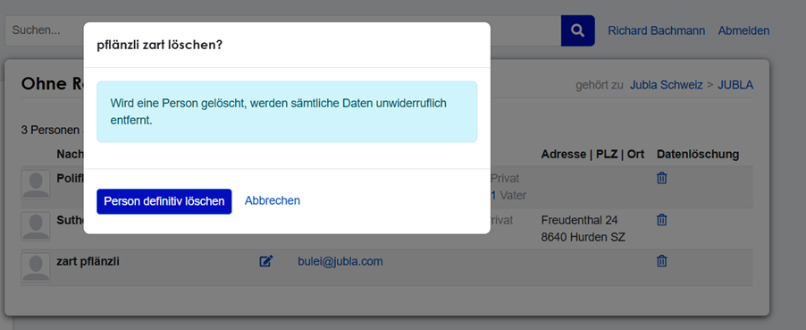
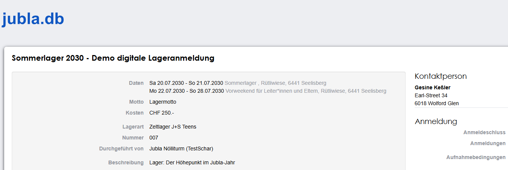
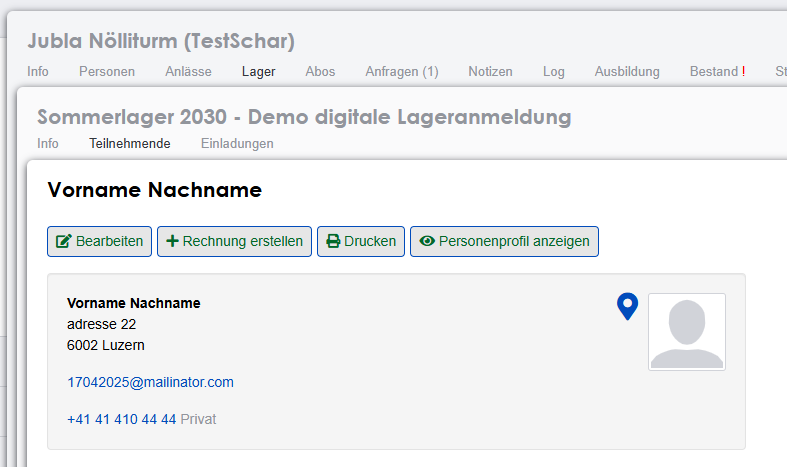

.. _changelog-news:

=========
Releases
=========

.. hint:: Im :fa:`tag` `Changelog <https://db.jubla.ch/changelog>`_ der Applikation ist die jeweilige Version und die vorgenommenen Aktualisierungen dokumentiert. Bei einem Release/Update wird die Datenbank jeweils für kurze Zeit gesperrt, gewartet und mit neuen Funktionen ausgestattet. Hier werden die jeweils wichtigsten Veränderungen für Jungwacht Blauring erwähnt.

Geplante Release-Daten 
=======================

.. list-table::
   :header-rows: 1
   :stub-columns: 1

   * - Release
     - Datum
     - Art des Releases
   * - 1/26
     - Di, 13. Januar 2026
     - Quartalsrelease
   * - 2/26
     - Di, 7. April 2026
     - Quartalsrelease
   * - 3/26
     - Di, 7. Juli 2026
     - Quartalsrelease
   * - 4/26
     - Di, 3. November 2026
     - Quartalsrelease

Release Version 2.8 - 13.01.2026 
=========================================

Release-Kommunikation von `Hitobito <https://mailchi.mp/6ac9692f6547/herbstliche-grsse-von-hitobito-6755185>`_.

- Rechnungen (Debitoren) auf Ebene Schar
Kassier*in auf Ebene Schar können Rechnungen erstellen. Es stehen die Standard-Funktionen des Rechnungsmodul zur Verfügung. Scharen könnten so aus der jubla.db aus Rechnungen für Mitgliederbeiträge oder Lageranmeldungen erstellen und verwalten. 

- Zwei-Faktor-Authentifizierung (2FA) für Rolle Kassier*in
In der jubla.db solltest du die Zwei-Faktor-Authentifizierung (2FA) aktivieren. Damit schützt du deinen Zugang zusätzlich – vor allem dann, wenn du Rollen mit erweiterten Berechtigungen oder Einsicht in Personendaten anderer Menschen hast. Du findest die Funktion in deinem Profil beim Button «Login» -> Zwei-Faktor-Authentifizierung einrichten. Für gewisse Rollen wird 2FA erzwungen: Rolle IT-Support/NEJB, Mitglied, Präses/Bundesleitung Adressverwaltung/NEJB Bundesleitung und Kassier*in/Schar.

- Kurse: Fragen zu schub/meisterwerk entfernt
Die Standard-Fragen in Kursen zum schub und meisterwerk wurden entfernt und erscheinen nicht mehr bei einem neu erstellten Kurs. Die Fragen sind im Leitfaden zur Kursadministration jeweils enthalten und dort aktuell. 

- Anerkennungen: Gültigkeit Sicherheitszusätze beschränkt (A&W)
Per 1.1.2026 beschränkt J+S die Gültigkeitsdauer der Sicherheitszusätze auf 4 Jahre. Deshalb werden auf der jubla.db bei allen bestehenden Sicherheitszusätzen (Berg, Winter, Wasser) die Gültigkeit mit Enddatum 31.12.2029 gesetzt. Zukünftige Anerkennungen werden automatisch mit einer vierjährigen Gültigkeitsdauer vergeben.

Release Version 2.7 - 04.11.2025 
=========================================

Release-Kommunikation von `Hitobito <https://mailchi.mp/d3d90ec4d2d3/herbstliche-grsse-von-hitobito-6754494>`_.

- Scharleitung kann Profile ohne Rollen löschen 
Die Scharleitung kann Profile in der Gruppe “ohne Rollen” neu selbständig löschen. Das Profil wird dann unwiderruflich entfernt. Die automatisch erstellte Gruppe mit dem Namen «Ohne Rollen» ist ein Auffangbecken für Profile welche keine Rolle (mehr) haben (eine Rolle ist z.B. “Mitglied” oder “Adressverwaltung”). Die Scharleitung kann Profile in der Gruppe «ohne Rollen» neu selbständig löschen. Das Profil wird dann unwiderruflich entfernt. Ein Austritt oder Beendigung der Mitgliedschaftsverhältnisse ist in den Statuten deiner Schar oder den Statuten von Jungwacht Blauring Schweiz geregelt. Die Abläufe und Regelungen der Vereins- und Vorstandsarbeit findest du im jubla.netz bei Vereinsmanagement oder Leitungsverantwortung als Schar- und Lagerleitung.

- Aktualisiertes Handbuch
In den letzten Wochen wurde das jubla.db Handbuch umfangreich aktualisiert und erweitert. 

- Debitoren/Rechnungen aus der jubla.db
Die Fachgruppe Datenbank sucht weitere interessierte Menschen zum Beispiel mit dem Scharkassen-Ämtli welche diese Funktionen mit der Fachgruppe Datenbank allen Scharen (und evtl. den Kantonen und Regionen) zugänglich machen möchten. Scharen könnten dann aus der jubla.db aus Rechnungen für Mitgliederbeiträge oder Lageranmeldungen erstellen und verwalten. Die Fachgruppe Datenbank hat die Absicht, im letzten Quartal 2025 auf der Testumgebung zu testen und das Feature mit dem Release 1/26 allen Scharen zugänglich zu machen.

- Anlässe mit Begleitpersonen/Gästen 
Ein Profil kann bei der Anmeldung an einen Anlass (ohne Kurse/Lager) optional zusätzliche Teilnehmende als Begleitpersonen anmelden. Für die Begleitpersonen gelten die gleichen Anmeldeangaben für den Anlass. Die Zusatzpersonen werden auch an die Anzahl Teilnehmenden gerechnet und erscheinen im Export. Wichtig: Für Gäste wird kein Profil/Rolle erstellt und sie erhalten keine Anmeldebestätigung: Das angemeldete Profil übernimmt die Kommunikation und Verantwortung für seine Begleitpersonen. Die Informationen sind nur im Anlass gespeichert und werden auch mit ihm wieder gelöscht.

- Datensicherheit
In der jubla.db solltest du die Zwei-Faktor-Authentifizierung (2FA) aktivieren. Damit schützt du deinen Zugang zusätzlich – vor allem dann, wenn du Rollen mit erweiterten Berechtigungen oder Einsicht in Personendaten anderer Menschen hast. Du findest die Funktion in deinem Profil beim Button «Login» -> Zwei-Faktor-Authentifizierung einrichten. In Zukunft wird 2FA für Rollen mit weitreichenden Berechtigungen technisch erzwungen. 

Release Version 2.6 - 01.07.2025 
=========================================

Release-Kommunikation von `Hitobito <https://mailchi.mp/5c6195cf398c/herbstliche-grsse-von-hitobito-6753281>`_.

- Veranstaltungen: Anzeigeoptionen der Kontaktperson 
Bei allen Events lässt sich neu einschränken, welche Kontaktdaten (Name, Adresse, Telefon, etc.) der Ansprechperson auf der Anmeldeseite sichtbar sind.  

- Veranstaltungen: Anmeldung und Profil 
Anlassverantwortliche für einen Event (Anlass, Lager, Kurs) haben neu einen Knopf bei den Teilnehmenden, um direkt zum Personenprofil zu navigieren (von der Anmeldung zum Profil).   

- Veranstaltungen: Anmeldeangaben 
Die Anmeldeangaben sind neu alphabetisch sortiert. 

- Duplikate 
Beim Zusammenführen werden neu die Rollen, Telefonnummern, zusätzlichen E-Mail-Adressen, Social Media Einträge, Rechnungen, Notizen, Tags, Abos, Familienmitglieder, Event Einladungen und Teilnahmen sowie auch Qualifikationen übernommen. Alle anderen Daten im Profil ohne Vorrang werden gelöscht.  

- E-Mail-Zustellung von Abos sicherstellen (Bounces)  
Im Abo (Mailing-Liste) gibt es neu den Tab Bounces. Eine Bounce Message (englisch bounce ‚abprallen‘, ‚zurückwerfen‘), ist eine Fehlermeldung, die von einem Mailserver automatisch erzeugt wird, wenn eine E-Mail nicht zustellbar ist. Auch im betroffenen Profil wird eine entsprechende Warnung angezeigt, damit die E-Mail-Adresse korrigiert werden kann. 

- Debitoren/Rechnungen aus der jubla.db 
Die Fachgruppe Datenbank sucht interessierte Menschen zum Beispiel mit dem Scharkassen-Ämtli welche diese Funktionen mit der Fachgruppe Datenbank allen Scharen (und evtl. den Kantonen und Regionen) zugänglich machen möchten. Scharen könnten dann aus der jubla.db aus Rechnungen für Mitgliederbeiträge oder Lageranmeldungen erstellen und verwalten. 

Release Version 2.5 - 01.04.2025 
=========================================

Release-Kommunikation von `Hitobito <https://mailchi.mp/7e7ea5cf2fea/herbstliche-grsse-von-hitobito-6752105>`_.

- AHV-Nummer nur noch in Event-Anmeldung  
Die AHV-Nummer wird in der jubla.db nur noch in Event-Anmeldungen (Lager/Anlässen) gespeichert. Bestehende Anmeldungen für aktuelle Veranstaltungen wurden aktualisiert. Im Profil selbst wird die AHV-Nummer nicht mehr gespeichert. Damit ist die schrittweise Umstellung (siehe Release 2.3.0) abgeschlossen. Die AHV-Nummer in einem Event wird wie alle Antworten inklusive Bemerkungen nach 13 Monaten nach dem Anlass automatisch gelöscht.

- Zusätzliche Felder für Selbstregistrierung 
Bei der Selbstregistrierung in Gruppen wurden die (Pflicht)-Felder aktualisiert. Neu kann die komplette Adresse und zusätzliche Kontaktmöglichkeiten angegeben werden. Damit können viel einfacher und schneller neue Kontakte entstehen. 

- Kurse: Standard-Fragen und -Einstellungen 
Für Kurse wurden die Standarteinstellungen und die Standardfragen aktualisiert. Wird auf einem Kurs ein Profil von den Anmeldungen zugeteilt, oder wieder zu den Anmeldungen verschoben, kann neu ausgewählt werden, ob eine E-Mail zur Bestätigung versendet werden soll. (Neue Funktion für alle Youth-Organisationen des Schweizer Alpen-Club)  

- Rechnungen (Debitoren) auf Ebene Bund 
Kassier*in auf nationaler Ebene (Bund) können Rechnungen erstellen. Es stehen die Standard-Funktionen des Hitobito-Rechnungsmodul zur Verfügung. Die Fachgruppe Datenbank sucht interessierte Menschen zum Beispiel mit dem Scharkassen-Ämtli welche diese Funktionen mit der Fachgruppe Datenbank allen Scharen zugänglich machen möchten. Scharen könnten dann aus der jubla.db aus Rechnungen für Mitgliederbeiträge oder Lageranmeldungen erstellen und verwalten. 

- Anfragen für alle Gruppen/Ebenen aktiv 
Die Funktion "Anfragen" wird für alle Gruppen/Ebenen aktiviert. Profile werden dadurch erst nach einer Freigabe durch das Profil selbst oder durch den Vorstand der Hauptgruppe zu einer Gruppe, Abo oder Anlass hinzugefügt. Damit kann eine Weitergabe von Daten gemäss Statuten und Datenschutzbestimmungen gesteuert werden. Mitglieder (und deren Profil-Informationen) können so nicht ohne aktive Zustimmung von anderen Ebenen/Gremien übernommen werden. Der Vorstand und der Mensch mit einem Profil teilen sich die Zuständigkeit für die Prüfung und Freigabe der Anfrage. Das Handbuch ist sowohl für die Mitglieder wie auch die Scharverwaltung aktualisiert.  
Als Regional- und/oder Kantonalverband, als nationale Geschäftsstelle oder als Netzwerk ehemalige Jungwacht Blauring ist der jeweilige Vorstand oder in ihrem Auftrag wirkende Menschen mitverantwortlich für die Zuteilung von Personendaten in andere Vereine, Veranstaltungen oder Abos gemäss den eigenen Statuten. Insbesondere für Profile welche deine Ebene als Hauptgruppe festgelegt haben: 
  - Die Anfrage-E-Mail wird an das Profil mit hinterlegter Haupt-E-Mail-Adresse und an die Ebene der gewählten Hauptgruppe verschickt.
  - Die Anfrage kann in der jubla.db durch das Mitglied/Profil oder direkt aus der E-Mail beantwortet werden.  
  - Für durch die Schar/Ebene verwaltete Profile ohne aktives Login ist der Vorstand (Scharleitung) zuständig.  
  - Der Vorstand hat damit Kenntnis über den Datenfluss seiner Mitglieder in der Mitgliederdatenbank und kann bei Bedarf handeln. Insbesondere bei Anfragen die über längere Zeit nicht beantwortet werden. 

- Statistik / Bestandsmeldung 
Der Tab Statistik (Bestandsmeldungen) ist wieder auf kantonaler Ebene verfügbar. 

Release Version 2.4.5 - 14.01.2025 
=========================================

Release-Kommunikation von `Hitobito <https://mailchi.mp/6fef1e179c10/herbstliche-grsse-von-hitobito-6750902>`_.

- Anmeldebestätigung (PDF)
Auf der Person unter «Meine nächsten Anlässe» wird ein zusätzlicher Link zur Anmeldung dieser Person auf dem Anlass angezeigt. Im eigenen Profil im Tab «Info» ist unter «Meine nächsten Anlässe» zu jedem Anlass ein Link mit «Teilnahme» welche direkt zur Anmeldung und der Anmeldebestätigung führt. Die Anmeldung beziehungsweise die Anmeldebestätigung kann so direkt und schnell aus der Datenbank erreicht werden. 
Sofern es eine Verwalterin oder Verwalter für den angemeldeten Menschen gibt, ist deren Name, E-Mail und Telefonnummer in der Anmeldung (PDF) direkt aufgeführt. Wer also einen Event/Anlass verantwortet, durchführt, verwaltet, coacht oder ähnlich, kann den Status der Verwalterinnen-Beziehung jederzeit überprüfen und in der Anmeldung sehen, ob das Profil verwaltet wird (Verwalterinnen hat) oder es Kinder verwaltet. Der oder die Verwalter*in kann so direkt auch kontaktiert werden. 

- Rolle Kind sieht nur öffentliche Daten
Die Rolle Kind kann nur öffentliche Daten (Gruppen, Anlässe und Abos; keine anderen Personen) sehen. Diese Rolle ist nur von Personen in der gleichen Ebene sichtbar, nicht von Personen aus darüber liegenden Ebenen. Diese Berechtigungen genügen im Jubla-Alltag und schützt die Informationen/Daten dieser Rolle in der Datenbank. Mit der Anmeldung an Events oder durch die Verknüpfung mit Verwalter*innen werden die Daten mit den jeweiligen Rollen und Ebenen geteilt.

- Anlässe: Bemerkungen und Antworten werden automatisch gelöscht 
Mit dem Release werden die Daten neu nach 13 Monaten gelöscht (Stichtag: Das zuletzt vor einem Jahr liegende "Von-Datum" im Event/Lager/Kurs/Anlass). Scharen und Event-Veranstalter*innen werden entlasten, dass sie nicht notwendige oder nicht legitimierbare Daten unbeschränkt aufbewahren. Die Antworten und Bemerkungen in Events werden automatisch gelöscht, damit dies der Vorstand oder die Event-Administration nicht manuell machen muss. 

- jubla.db für das Netzwerk Ehemalige Jungwacht Blauring
Mit dem Release besitzt das Netzwerk Ehemalige Jungwacht Blauring (NEJB) eine eigene Struktur in der Datenbank. Dieser Top-Knoten dient dem Netzwerk, den Ehemaligenvereinigungen und ihren Mitgliedern zur Mitgliederverwaltung. Aktive Ehemaligenvereinigungen können in Zukunft als Kollektivmitglieder des Netzwerks ihre Mitglieder, Netzwerkpartner*innen und Dienstleister*innen verwalten. Die jubla.db folgt damit dem Jubla-Verständnis von Lebensfreunden fürs Leben. Das Netzwerk Ehemalige Jungwacht Blauring ist der nationale Verein, der das Ehemaligenwesen koordiniert. Als Ehemalige*r kannst du zukünftig Mitglied werden und bekommst mit deinem jubla.db Profil eine Rolle in diesen Vereinen. Kantonale und regionale Ehemaligen-Vereinigungen können Kollektivmitglieder werden. Mehr: https://www.jubla.ch/ehemalige

- Top-Knoten Ehemalige 
Technisches Konstrukt, verwaltet durch das Netzwerk Ehemalige Jungwacht Blauring.  Nachdem Strukturen wie Ebenen (Kantone/Regionen) oder Ehemaligenvereinigungen entstanden sind, können in Zukunft unter Koordination durch das Netzwerk die Vereine in der jubla.db aktiv sein und sich vernetzten.    

- Rolle «Austritt» 
Die Rolle «Ehemalig» wird in «Austritt» umbenannt. Diese aktive Rolle wird automatisch vergeben, wenn die letzte Rolle entfernt wird. Üblicherweise signalisiert sie den Austritt aus einer Schar oder einer Ebene/Gruppe.  
Die Umbenennung in Austritt soll verdeutlichen, dass sie für die Zeit vorgesehen ist in der ein Mitglied (nicht nur auf lokaler Ebene) den Austritt angekündigt hat bis zu deren Umsetzung und Mutation.  
Die Folge davon: Wird der Austritt korrekt vollzogen, wird die Rolle «Austritt» vergeben. Austritte werden regelmässig (an der GV) verabschiedet und danach die Rolle «Austritt» vom Profil entfernt. Profile ohne Rollen werden danach dadurch zu ausgetretenen Leitungspersonen oder in die Gruppe «ohne Rollen» auf dieser Ebene verschoben.  Das Profil hat danach die korrekte «Inaktive Rolle» in seinem Verlauf. Dies führt dazu, dass die Mitgliedschaft in einem Verein mit dem Austritt vollzogen werden kann. Mit dem Austritt ist das Profil danach korrekt kein Mitglied mehr und der Übertritt ins Ehemaligenwesen wird möglich.   

- Ausgetretene Leitungspersonen auf ebene Schar 
Die automatisch erstellte Gruppe Ehemalige auf Scharebene ist ein Auffangbecken für Mitglieder welche früher eine Rolle (wie zum Beispiel «Leiter/in») in der Schar hatten. Diese Gruppe wird zukünftig mit dem Namen «Ausgetretene Leitungspersonen» auf Ebene Schar geführt. Die Schar bleibt weiterhin mitverantwortlich für diese Profile.  

Release Version 2.3.1 - 21.10.24
=========================================

Mit diesem Release wird Puzzle/Hitobito jubla.db Umgebungen auch auf eine neue Hosting-Platform migrieren. Aus diesem Grund wird der Unterbruch der Umgebungen diesmal länger dauern. Es ist mit Unterbrüchen zwischen 30-60 Minuten zu rechnen. Im Release selbst werden die Aktualisierungen der Version 2.3.0 enthalten sein.

Release Version 2.3.0 - 
=========================================

Release-Kommunikation von `Hitobito <https://mailchi.mp/8fc1d655db7e/herbstliche-grsse-von-hitobito-6749548>`_:
Kommunikation zur `Verschiebung durch Hitobito <https://mailchi.mp/6e6434ecd597/herbstliche-grsse-von-hitobito-6749780>`_:

.. Achtung:: :fa:`bug` Beim Hitobito Release 2.3.0 geplant auf den Di, 01. Oktober sind unerwartete Komplikationen bei der Datenmigration aufgetreten. Der Release wurde abgebrochen und die jubla.db auf die ursprüngliche Version zurückgesetzt. Veränderungen wie Mutationen oder Anmeldungen im Zeitraum vom Dienstag, 1. Oktober zwischen 14:00 Uhr und 15:15 Uhr gingen dabei verloren. Alle Jublasurium-Anmeldungen wurden rekonstruiert und die betroffenen Scharen direkt informiert.

Für die jubla.db sind Unterbrüche an folgenden Daten geplant:
Dienstag, 01.10.2024: ca 30 min während Büroöffnungszeiten für den Release.

- Anlässe: Bemerkungen werden automatisch gelöscht 
Die Bemerkungen einer Anlassteilnahme werden ab sofort nach einer gewissen Zeit automatisiert gelöscht. Mit diesem Release wird der Wert auf 5 Jahre (60 Monate) gesetzt und betrifft somit lediglich Daten, welche bereits verjährt sind. Mit einem folgenden Release ist geplant diesen Wert auf 13 Monate zu senken. Damit muss sich eine Schar oder Event-Administration nicht mehr darum kümmern, ob nicht notwendige oder nicht legitimierbare Daten unbeschränkt aufbewahrt werden.  

 
- AHV-Nummer neu im Event (Lager, Kurse, Anlässe) 
Die AHV-Nummer kann neu mit der Anlassanmeldung (Lager, Kurs) gemäss Einstellungen (zwingend, optional, ausgeblendet) erhoben werden.   
Für Unterstützungsgelder von Jugend+Sport (das Förderprogramm des Bundesamts für Sport BASPO) werden in der jubla.db Daten erhoben und mit dem BASPO in der Nationale Datenbank Sport (NDS) geteilt. Für die datenschutzkonforme Erhebung und Speicherung der AHV-Nummer wird diese nur noch für den Anlass gespeichert und wird zukünftig aus den Profil-Informationen verschwinden. Die NDS übernimmt die zentrale Rolle für die Speicherung der  AHV-Nummer und kann Daten bereits bekannter Profile ergänzen.  

 
- Kursadmninistration: Neue Standard-Fragen 
Für Kurse wurden die Standard-Fragen aktualisiert. Sie können neu über die Einstellungen (zwingend, optional, ausgeblendet) gesteuert werden. Weiterhin ist es natürlich möglich, eigene oder angepasste Fragen zu verwenden. In bestehenden Kursen wird empfohlen, die zusätzlichen Standard-Fragen auszublenden und die bestehenden Fragen nicht zu löschen, um die Antworten der angemeldeten Profile nicht zu verliehren. 

Release Version 2.2.0/2.1.5 - 02.07.2024
=========================================

Release-Kommunikation von `Hitobito <https://mailchi.mp/970967e0bb60/herbstliche-grsse-von-hitobito-6748370>`_:

- Adresse, Hausnummer, zusätzliche Adresszeile
Neu gibt es zwei separate Felder für die Strasse und die Hausnummer (früher Adresse, neu Zahlungsverkehrsstandard ISO20022). Diese Änderung geht bei den meisten Adressen automatisch. Es kann Aunsahmen gehen, in denen das Profil manuell aktualisert werden muss. Im Feld zusätzliche Adresszeile können zusätzliche Adressangaben untergebracht werden. 
Es wird empfohlen, sowohl das Feld **Strasse wie auch die Hausnummer als Pflichtfeld** für Events (Kurse, Lager, Veranstaltungen, NDS-Import) oder Mitgleiderverwaltung/Zahlungsiformationen festzulegen.   

- Haushalt
Profile (und deren Adressen) können in einem Haushalt im Tab "Info" von einem Profil zusammengefasst werden. So können Haushalte/Familien usw. insbesondere bei Birefversänden effizienter angeschrieben werden. 

- Personenfilter
Der Personenfilter kann neu etliche neue Filtermöglichkeiten in denen Rollen, Qualifikationen und deren Status (gültig, ungültig, reaktivierbar, etc.) möglich ist.

- Anhänge (PDF) für Anlass-Teilnehmende
Bei Anhängen zu Events (Anlass, Kurs, Lager) kann neu definiert werden, für wen diese sichtbar sein sollen. Sie können für das Leitungsteam, das Leitungsteam & Teilnehmende, oder Global für alle sichtbar sein. 

- Kontaktrelevanz von Fachgruppen-Mitglieder
Kontaktrelevanz gilt weiterhin für Vorstand-Aufgaben und deren Rollen. Einzig die Mitglieder von Fachgruppen der nationalen Ebene sollen (weiterhin) Kontaktrelevanz (:contact_data) haben, da sie auch als Mitglieder dieser Fachgruppe gegenüber dem Verband auftreten und somit in diesem Kontext eine Vorstand-Aufgabe innehaben. Mitglieder von nationalen Fachgruppen sollen sich als als kontaktrelevant markiert, mit allen anderen Menschen mit kontaktrelevanten Rollen sehen und mit ihnen im Austausch stehen können. Mitglieder in Fachgruppen werden durch den Vorstand gegenüber dem Verband vertreten und vernetzt.

- Sichtbarkeit “Schwestergruppen”
Die Sichtbarkeit (Exportierbarkeit) von “Schwestergruppen” (Scharen in der gleichen Region) wurde gemäss geltenden Statuten und Datenschutzbestimmungen angepasst und den Rollen und Berechtigungen (Hitobito Standard) angepasst. Wie bisher ist jeweils die übergeordnete Ebene für die Koordination der darunterliegenden Gruppen/Ebenen zuständig. Scharen finden in Handbuch Informationen, wie eigenständige Scharen (zum Beispiel Jungwacht und Blauring) einen gemeinsamen Anlass oder zusammen Mitglieder in beiden Vereinen verwalten können. 

- Nextcloud
Die technische Grundfunktion wurde erweitert, damit eine Nextcloud-Instanz die Eben und Rolle mit einem Login mitgibt. Auf Seiten Nextcloud können diese Informationen für Berechtigungen und Rollen genutzt werden. (Produktiver Einsatz noch nicht empfohlen).

Release Version 2.1.0 - 02.04.2024
===================================

Release-Kommunikation von `Hitobito <https://mailchi.mp/7bb30adab153/herbstliche-grsse-von-hitobito-6719867>`_:

- Geschlecht
Die Geschlechteroptionen in unserer Datenbank: In der jubla.db stehen drei Geschlechteroptionen zur Auswahl: weitere/kein, weiblich und männlich. Mehr dazu: https://jubladb-handbuch.readthedocs.io/de/latest/qa.html#geschlecht-gender

- Datenschutzerklärung
Der Text für die Datenschutzerklärung und Consent in der jubla.db wurde angepasst. Jede Schar/Gruppe kann bei Bedarf ihre eigenen Besimmungen in den Seiten-Informationen hinterlegen.

- Hauptgruppe (für Profil)
Die Hauptgruppe für aktive Rollen im Profil kann wieder gesetz werden und wird wieder mit dem Stern-Symbol im Profil angezeigt.

- Event-Bemerkungen 
Das Feld Bemerkungen (Allgemeines, Gesundheitsinformationen, Allergien, usw.) in Anlässen/Lagern/etc. kann neu in der Spaltenauswahl angezeigt und exportiert werden.

- Qualifikationen
Qualifikationen werden neu zusätzlich im Verlauf einer Person aufgeführt. Qualifikationsarten haben neu eine Einstellung für erforderliche Ausbildungstage, welche für eine erfolgreiche Verlängerung erreicht werden müssen.

- Abos
Auf Abos gibt es neu die Option, dass nur definierte Personen sich selbst für ein Abo an- oder abmelden können. Auch gibt es die Option zu definieren, ob nur eine an- oder nur abmeldung möglich ist. Es wird empfohlen, seine Abos zu überprüfen und entsprechend zu aktualisieren oder nicht mehr verwendete Abos zu löschen.

- Kurse
Ist bei Kursen die Freigabe aktiviert, werden E-Mails an den Scharleiter wieder korrekt versendet.

Release Version 2.0 (1.30) - 09.01.2024
========================================

Release-Kommunikation von `Hitobito <https://mailchi.mp/4e0e63733071/herbstliche-grsse-von-hitobito-6685199>`_:

- Elternzugang
Seit dem Release ist die technische Grundlage bereit um in der Datenbank Eltern oder Erziehungsberechtigte so zu erfassen, dass sie Zugriff auf ihre Kinder haben. Dank dieser Funktion ist eine Einsicht in die Daten der Kinder und deren Anmeldung zu Anlässen, Kursen und Lagern möglich. Eltern benötigen ab jetzt nur ein Profil (und eine E-Mail-Adresse), um mehrere Kinder verwalten zu können.

- Nextcloud
Die jubla.db besitzt nund die technische Grundfunktion, damit sich Profile aus der Datenbank direkt in eine Nextcloud-Instanz im Besitz einer Ebene (Schar/Verein) anmelden kann. 

- Frontend-Toolkit Bootstrap 5
Das Frontend-Toolkit Bootstrap wurde von der Version 2 auf 5 aktualisiert. Die Darstellung (Frontend) der Applikation profitiert davon.

- Ruby 3.0
Mit diesem Release erfolgt ein Upgrade auf Ruby 3.0. Es hat keinen Einfluss auf das Verhalten oder Funktionen der jubla.db, ist eber für die Sicherheit und Zukunftskompatibilität wichtig.

- Gruppen/Schar-Tab "Einstellungen" 
Der Tab "Einstellungen" auf Ebene Schar/Kanton/etc. wurde entfernt und die Optionen (Briefe/SMS-Provider) sind neu in der Bearbeitungsansicht der Gruppe unter dem Tab "Abos". 

- Seite für Selbstregistrierung
Neu gibt es für die Schar (Gruppen) mit aktivierter Selbstregistrierung eine Seite, über welche sich auch eingeloggte Personen in der Gruppe einschreiben können. Menschen ohne Profil wird weiterhin die bisherige Seite für eine externe Registrierung angezeigt.

- Zugriffs Ansicht im Tab Sicherheit
Der Sicherheits-Tab eines Profil kann neu die Gruppen und Rollen auflisten, welche Zugriff auf einem haben.

- Abos einfacher zuweisen
Auf der Personen-Listenansicht können neu via Multiselekt Personen als Abonnenten einem Abo hinzugefügt werden. Abos können so einfacher und schneller erstellt oder verwaltet werden.

- Datenschutzerklärung pro Ebene 
Neu kann auf einer Ebene eine Datenschutzerklärung (DSE) hinterlegt werden. Diese muss, falls vorhanden, bei der Selbstregistrierung, dem Anmelden bei einem Anlass/Kurs oder dem Hinzufügen einer Person auf einer Gruppe akzeptiert werden um fortzufahren. Informationen zum Datenschutz im jubla.netz: https://jubla.atlassian.net/l/cp/FgNbRw1v 

- Export gemäss BSV-Regeln
Der BSV-Export berücksichtigt jetzt gemäss den neuen BSV-Regeln alle Personen unter 30 Jahren (statt wie zuvor nur zwischen 17 und 30 Jahren).

Release Version 1.28 - 15.11.2022
==================================

- Kursfilter
In der Kursübersicht in der Datenbank können die Kurse neu gefiltert werden. Standardmässig werden die Kurse des eigenen Kantons und der nationalen Ebene angezeigt. Die ausserkantonalen Kurse sind via DropDown auffindbar, die Suche nach alternativen Kursangeboten wird einfacher. Wer den Kurs durchführt, ist neu in der Übersicht direkt sichtbar. Weiterhin ist die Sichtbarkeit von Kursen und Veranstaltungen über die Option "Anlass ist für die ganze Datenbank sichtbar" einstellbar.

- J+S Reaktivierung von Qualifikationen
Das Bundesamt für Sport BASPO hat Änderungen an der Reaktivierung von Qualifikationen vorgenommen, der Status “weggefallen archiviert” wurde aufgehoben (Siehe hier). Die Datenbank kommt nun mit diesen neuen Bedingungen zurecht. Die Vorbedingungen einer Kursart können deshalb neu als "Muss gültig sein" oder "Muss gültig oder weggefallen sein" deklariert werden. Wenn die Vorbedingung gültig sein muss, verhält es sich wie bisher, bei gültig oder weggefallen muss der*die Teilnehmer*in die Qualifikation der Vorbedingung besitzen oder jemals besessen haben. Dies gilt unabhängig von der Gültigkeit oder Reaktivierbarkeit der besagten Qualifikation.

- Rollen in Kursen und deren Qualifikationsverlängerung (NDS)
Im Dezember 2022 wird die neue Nationale Datenbank für Sport (NDS) ihren Betrieb aufnehmen. Für die korrekte Übertragung der Qualifikationsverlängerungen sind nun Anpassungen an den Rollen notwendig. Die Rolle «Kurshelfer*in» ist neu für Personen vorgesehen, welche mindestens 6h Kadertätigkeit ausüben. Die Rolle «Referent*in» für weniger als 6h Kadertätigkeit. Im Bereich «Qualifikationen» sind deshalb neu nebst Hauptleitung und Leitung auch «Helfer*innen» aufgeführt. Ihnen können nun auch die Qualifikationen verlängert werden. 

- Berechtigungen der Rolle Coach angepasst
Die Rolle «Coach» kann neu neben der Hauptleitung (Lagerleitung) und Leitung ebenfalls die Lager-Teilnehmenden-Liste exportieren (CSV Datei SPORTdb/NDS) und gemäss Vorgaben verwenden. 

- Wer ist wo im Lager
Die kantonalen/regionalen Arbeitsstellen und die nationale Geschäftsstelle haben über ein neues Modul “Lager” eine Übersicht über die Lager in ihrer jeweiligen Ebene, sofern das Lager als “sichtbar” angelegt wurde. Die Möglichkeit zur Koordination oder Unterstützung wird so unterstützt. 

- Personentab Sicherheit
Berechtigte Personen, wie zum Beispiel die Scharleitung, können den Personentab für Sicherheit und Datenschutz verwenden.

Release Version 1.27 - 12.07.2022
==================================

- Gruppen-Kalender 
In den Einstellungen jeder Gruppe lassen sich neu Kalender-Feeds einrichten. So können Anlässe, Kurse, Jahrespläne etc. im eigenen Kalender (z.B. in deinem Smartphone-Kalender oder im Outlook) eingebunden werden. Das Smartphone oder die Applikation muss dazu die Funktion «Importieren oder Abonnieren eines Kalenders per URL» haben. 
Rollen mit Start- und Enddatum 
Rollen können beim Erstellen und Editieren neu ein Start- und Enddatum erhalten. In der Zukunft liegende Daten passen dann die Rolle automatisch an. Beim Planen darauf achten, dass eine Person nicht ungewollt alle Rollen verliert. Siehe auch jubla.db-Erweiterung für Ehemalige. 

- Anlässe 
Kontaktpersonen können sich über neue Anmeldungen per E-Mail benachrichtigen lassen. Die Option kann in den Einstellungen für einen Termin aktiviert werden. Hier lassen sich auch neu Tags für Anlässe, Kurse oder Lager setzten. 

- Sicherheit 
Der persönliche Zugang zur Datenbank kann optional mit einem «Time-based One-Time Password» (TOTP/2FA) zusätzlich geschützt werden. Apps wie FreeOTP von Red Hat (OpenSource), google Authenticator oder Microsoft Authenticator können den zusätzlichen Zahlencode für das Login generieren. Sichere deine Zugangsdaten so, dass du beim Verlust deines Smartphones den Zugang zur Datenbank nicht verlierst.  
Die Haupt-E-Mail-Adresse (wird als Login verwendet) muss zukünftig bei Änderungen bestätigt werden.  

Release Version 1.26 - 07.12.2021
=================================

- Verlängerung der Qualifikationen parallel zu J+S
Die ausserordentliche Verlängerung der Einsatzberechtigung von J+S-Leiter*innen wird in der Datenbank bei den betroffenen Personen auf «gültig bis 31.12.2022» mutiert.

- Passwort-Richtlinie gemäss aktuellen Empfehlungen 
Bestehende Passwörter bleiben unverändert gültig. Neue Passwörter müssen mindestens 12 Zeichen lang sein. Weiterhin werden keine Vorgaben für Zahlen, Sonderzeichen, Gross- und Kleinschreibung gemacht.

- Kursfilter für Kursansicht 
Neu können Kurse zusätzlich nach verschiedenen Kriterien wie Datum, Gruppen, Kursart, Kurskategorie oder freien Plätzen gesucht werden.

- Sichtbarkeit von Anlässen / Kursen / Lagern 
Anlässe, Kurse und Lager sind neu ans Berechtigungssystem der Benutzer*innen angeglichen und nicht mehr für alle sichtbar. Bei Bedarf kann ein Anlass weiterhin für die ganze Datenbank sichtbar gemacht werden.

- Einladungen zu Anlässen & Lagern in der Datenbank 
Neu sind Einladungen zu Anlässen und Lagern möglich. Die eingeladene Person sieht dann auf der Info-Seite des entsprechenden Events eine Auswahl, um sich an- oder abzumelden. 

- Teilnehmersichtbarkeit: Gegenseitige Sichtbarkeit von Teilnehmer*innen von Anlässen 
Neu kann für jeden Anlass, jeden Kurs und jedes Lager separat konfiguriert werden, ob sich die angemeldeten Teilnehmer*innen gegenseitig sehen. (Standardmässig ist die Sichtbarkeit deaktiviert)
Du hast Fragen oder kommst du nicht weiter? Dann melde dich bei deiner kantonalen/regionalen Arbeitsstelle. 
