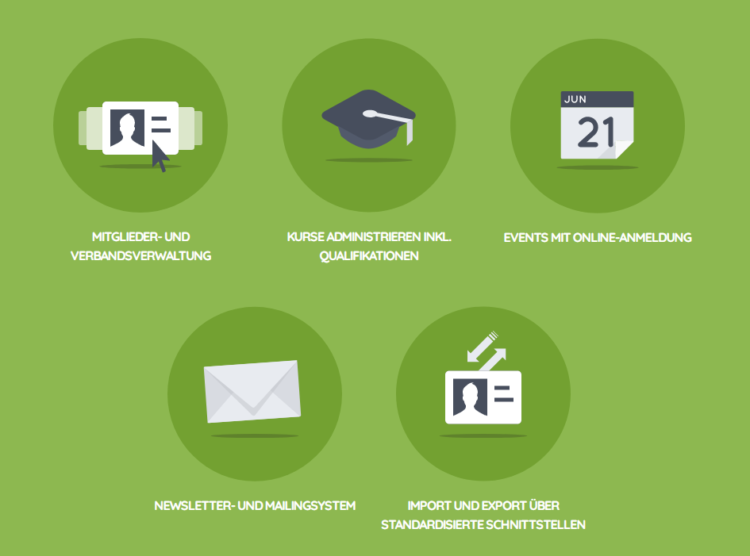

================================
Nationale Datenbank Hintergrund
================================

Vor über 10 Jahren haben sich die kantonalen Jubla Verbände von handgeschriebenen Listen, Excel- oder Accesslösungen verabschiedet und mit Puzzle ITC eine Open Source Lösung für die Mitgliederverwaltung entwickelt. 
Entstanden ist eine nationale Mitgliederdatenbank (`jubla.db <https://db.jubla.ch/>`_) für rund 400 Jubla-Scharen, die damit ihre Aktivitäten für ihre über 30'000 Mitglieder organisieren. 

Die FG Datenbank (bis Mai 2013 AG Datenbank) war von Ende 2010 bis Mai 2013 mit der Planung, Erarbeitung und Lancierung einer nationalen Datenbank für Jungwacht Blauring beschäftigt. Im Mai 2013 wurde die «jubla.db» offiziell im Verband eingeführt. Seit 2016 (BV1-26) unterstützt die Fachgruppe Digitalisierung die Weiterentwicklung der Mitgliederverwaltung aus Sicht der Nutzenden. Ihr Aufgabe ist unter anderem die Gründung von temporären Projektgruppen oder dauerhaften Arbeitsgruppen zur Ausarbeitung von aufgabenspezifischen Themen im Bereich Digitalisierung. So zum Beispiel für die Mitarbeit an zu entwickelnden Features der Mitgliederverwaltung. Bedürfnisse werden entweder durch das Eigenengagement ehrenamtlicher Themenverantwortlicher direkt getragen (Projektgruppen) oder über den formalen Priorisierungsprozess (Beurteilungsraster/Anträge/Steuergruppe Digitalisierung) zur Umsetzung begleitet.

Hitobito
=========

``jubla.db = hitobito``

**hitobito** ist eine Softwarelösung die von **Puzzle ITC** angeboten wird und für die Mitgliederverwaltung zuständig. Mittlerweile wird die Open Source Lösung mit dem Namen hitobito auch von der Pfadibewegung Schweiz, Cevi Schweiz, Pro Natura Jugend, Stiftung für junge Auslandschweizer oder Katholische Landjugendbewegung Deutschlands e.V. verwendet. Durch einen wiederverwendbaren Kern und individuellen Anpassungen der Applikation profitieren alle Community-Mitglieder von der gemeinsamen Basis.

Dein Beitrag zu dieser Anleitung
=================================

Du kannst selbst deinen Beitrag leisten und Ergänzungen vornehmen, in dem du auf `GitHub <https://github.com/jubla-ch/handbuch-jubladb-hitobito>`_ Korrekturen an den Anleitungsseiten vornimmst. 
