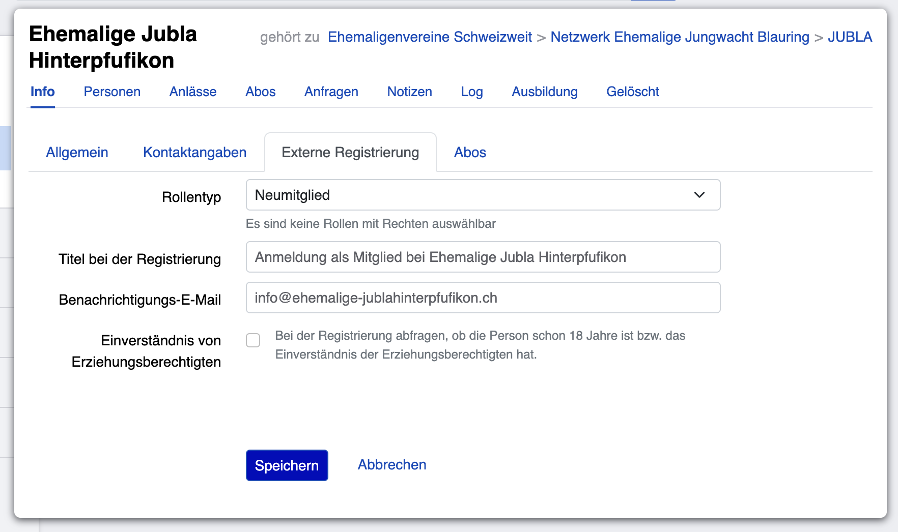

====================================
Selbstregistrierungslink aktivieren
====================================

Mit dem Selbstregistrierungslink können sich neue Personen selbst anmelden und hinzufügen – ohne dass du sie manuell eintragen musst. Diese Seite zeigt dir, wie das funktioniert.

.. warning::
   **WICHTIG – ACHTE AUF DIE EBENE!**
   
   Es macht einen grossen Unterschied, auf welcher Ebene du den Selbstregistrierungslink aktivierst:
   
- **Auf Vereinsebene:** Personen, die sich registrieren, werden dem **Verein** hinzugefügt (**empfohlen!**).
- **Auf Gruppenebene:** Personen, die sich registrieren, werden nur der **Gruppe** hinzugefügt, NICHT dem Verein.

.. warning::
**Du brauchst Berechtigungen:** Nur Personen mit der Rolle **«Leitung»** oder **«Adressverwaltung»** können den Selbstregistrierungslink aktivieren.

Wann sollte ich den Selbstregistrierungslink nutzen?
======================================================

Der Selbstregistrierungslink ist perfekt für:

- **Neue Mitglieder werben** – Teile den Link auf deiner Website, in sozialen Medien oder per Newsletter.
- **Schnelle Registrierung** – Personen melden sich selbst an, ohne dass du aktiv werden musst
- **Profil-Daten sparen** – Personen tragen ihre Daten selbst ein (genauer und aktueller).
- **Bestehende Personen hinzufügen** – Personen mit bestehendem Account werden automatisch zur Gruppe hinzugefügt.

**Alternative:** Du kannst auch :ref:`Personen manuell hinzufügen <ehemalige_person_hinzufuegen>` – das ist sinnvoll, wenn du nur einzelne Personen hinzufügen möchtest.

Schritt-für-Schritt: Selbstregistrierungslink aktivieren
==========================================================

1. Öffne deinen Ehemaligenvereins.
2. Klicke auf den Reiter ``Info``.
3. Klicke auf den Button ``Bearbeiten``.
4. Klicke auf den Reiter ``Externe Registrierung``.

**Schritt 5: Stelle die Einstellungen ein**

Jetzt siehst du folgende Felder:

**Rollentyp** (wichtigste Einstellung!)
   - Welche Rolle erhält eine Person, die sich selbst registriert?
   - Üblich: ``Neumitglied`` (kann später in ``Mitglied Ehemalige`` geändert werden).

**Titel der Selbstregistrierung**
   - Das ist die Überschrift, die Personen beim Registrierungs-Formular sehen
   - Beispiel: «Anmeldung Ehemaligenverein Jubla Hinterpfufikon», «Jetzt beitreten»

**Benachrichtigungs-E-Mail**
   - Wer soll eine Email bekommen, wenn sich eine neue Person registriert?
   - Beispiel: die Adressverwaltung oder der*die Präsident*in.

**Einverständnis von Erziehungsberechtigten**
   - Nicht relevant für Ehemalige – du kannst dieses Feld ignorieren

6. Klicke auf den Button ``Speichern``
7. Gehe zurück zur Info-Seite des Vereins (Reiter ``Info``). Dort siehst du den Selbstregistrierungslink angezeigt
   - Beispiel: ``https://db.jubla.ch/groups/00000/self_registration``.

Schritt-für-Schritt: Selbstregistrierungslink deaktivieren
============================================================

1. Öffne deinen Ehemaligenvereins.
2. Klicke auf den Reiter ``Info``.
3. Klicke auf den Button ``Bearbeiten``.
4. Klicke auf den Reiter ``Externe Registrierung``.
5. Bei «Rollentyp» wählst du ``Nicht erlaubt``. Das deaktiviert den Selbstregistrierungslink. Personen können sich jetzt nicht mehr selbst registrieren.
6. Klicke auf ``Speichern``.

Den Link teilen – So funktioniert's
====================================

Der Selbstregistrierungslink kann überall geteilt werden:

**Per Email**
   - Kopiere den Link in eine Email
   - Beispiel: «Möchtest du unserem Ehemaligenverein beitreten? Hier kannst du dich anmelden: [LINK]»

**Auf deiner Website**
   - Platziere den Link auf deiner Vereins-Website
   - Beispiel: als Button «Jetzt beitreten» oder im Text

**In sozialen Medien**
   - Teile den Link auf Facebook, Instagram, LinkedIn
   - Beispiel: «Du bist Jubla-Ehemalige*r? Tritt unserem Verein bei → [LINK]»

**Im Newsletter**
   - Versende den Link per Newsletter an interessierte Personen
   - Nutze eine auffällige Formulierung

**Per WhatsApp oder Messaging**
   - Teile den Link direkt in Nachrichten-Gruppen
   - Persönlich oder in Gruppen-Chats

**QR-Code (optional)**
   - Der Link kann auch als QR-Code generiert und gedruckt werden
   - Online-Tools können den Link in einen QR-Code umwandeln
   - Praktisch für Plakate oder Flyer

Was passiert bei der Selbstregistrierung?
===========================================

**Für neue Personen (kein bestehender Account):**

1. Person öffnet den Link
2. Sieht das Registrierungs-Formular mit deinem Titel. 
3. Füllt die folgende Felder aus:

   - Vorname, Nachname
   - Email-Adresse
   - Adresse
   - Weitere Angaben (optional)

4. Klickt auf ``Registrieren``.
5. Neuer Account wird erstellt und Person wird mit der gewählten Rolle der Gruppe hinzugefügt
6. Du erhältst eine Benachrichtigungs-Email (wenn konfiguriert).

**Für bestehende Personen (haben bereits einen Account):**

1. Person öffnet den Link
2. Person klickt auf den Button ``Anmelden und Einschreiben``.
3. Nach dem Login wird die Person mit der festgelegten Rolle automatisch zur Gruppe hinzugefügt.
4. Es erscheint eine Info: «Sie sind bereits Mitglied dieser Gruppe» (falls Person schon hinzugefügt war)
5. Du erhältst eine Benachrichtigungs-Email (wenn konfiguriert)

**Rolle der neuen Person:**

- Die Person erhält die Rolle, die du unter «Rollentyp» eingestellt hast (z.B. «Neumitglied»)
- Diese Rolle kann später geändert werden (siehe :ref:`Personen verwalten <ehemalige_rollen_aendern>`)

Best Practice: Tipps für erfolgreiche Selbstregistrierung
===========================================================

**1. Aktiviere den Link auf Verein-Ebene:** Aktiviere den Link auf Vereinsebene! So landen neue Personen im Verein.

**2. Wähle eine aussagekräftige Rolle:** «Neumitglied» ist eine gute Wahl – so kannst du neue Personen später noch überprüfen und in «Mitglied Ehemalige» ändern.

**3. Teile den Link breit:** Website, Newsletter, Social Media – je mehr Menschen den Link sehen, desto mehr Beitritte!

**4. Pflege regelmässig die Benachrichtigungs-Emails:** Prüfe regelmässig, welche neuen Personen sich registriert haben, und validiere ihre Daten.

**5. Erkläre den Titel verständlich:** «Jetzt beitreten» ist besser als «Externe Registrierung»
   
**6. Personen-Check:** Nach der Registrierung kannst du die neue Person überprüfen.

Häufige Fragen
===============

Wie viele Links gibt es pro Verein/Gruppe?
-------------------------------------------

Es gibt genau einen Link pro Verein oder Gruppe. Du teilst diesen einen Link überall. Es gibt keine verschiedenen Links für unterschiedliche Zwecke.

Was ist der Unterschied zwischen «Neumitglied» und «Mitglied Ehemalige»?
--------------------------------------------------------------------------

**Neumitglied:** Eine Person, die sich gerade registriert hat und möglicherweise noch überprüft werden muss (z.B. ob die Email korrekt ist).

**Mitglied Ehemalige:** Ein bestätigtes, aktives Mitglied des Vereins.

Du kannst Personen später von «Neumitglied» zu «Mitglied Ehemalige» upgraden (siehe :ref:`Personen verwalten <ehemalige_rollen_aendern>`).

Was passiert, wenn sich die gleiche Person mehrfach über den Link anmeldet?
---------------------------------------------------------------------------

Beim zweiten Mal sieht die Person die Info: «Sie sind bereits Mitglied dieser Gruppe/dieses Vereins». Sie wird nicht nochmal hinzugefügt.

Bekomme ich eine Email, wenn sich jemand registriert?
------------------------------------------------------

Ja, wenn du unter «Benachrichtigungs-E-Mail» deine Email-Adresse eingegeben hast. Du erhältst dann jedes Mal eine Benachrichtigung, wenn sich eine neue Person registriert.

Kann ich den Link später ändern oder ist er fix?
--------------------------------------------------

Der Link selbst ist fix (bleibt gleich). Aber du kannst die Einstellungen **unter** dem Link jederzeit ändern (Rollentyp, Titel, Benachrichtigungs-Email).

Funktioniert das gleich für Verein und Gruppen?
-------------------------------------------------

Ja, absolut gleich! Der Prozess ist identisch – ob du den Link auf Verein- oder Gruppen-Ebene aktivierst.

**Aber Achtung:** Personen werden nur der Ebene hinzugefügt, auf der du den Link aktiviert hast (siehe Warning oben).

Was ist, wenn mein Verein zu viele Selbstregistrierungen erhält?
------------------------------------------------------------------

Das ist ein gutes Problem! 😊 Du kannst jederzeit den Link deaktivieren (Rollentyp auf «Nicht erlaubt» setzen). Neue Personen werden dann nicht mehr automatisch hinzugefügt.

Alternativ kannst du neue Personen manuell überprüfen, bevor du sie in «Mitglied Ehemalige» änderst.

Kann eine Person sich über den Link abmelden?
----------------------------------------------

Nein, der Link ist nur zum Beitreten. Zum Austritt müssen Personen dich kontaktieren oder du entfernst sie manuell (siehe :ref:`Rollen entfernen <ehemalige_rollen_entfernen>`).

Wo sehe ich den Link nach der Aktivierung?
--------------------------------------------

Der Link wird auf der Info-Seite des Vereins/der Gruppe angezeigt. Gehe zu:

1. Verein/Gruppe öffnen
2. Reiter ``Info``
3. Der Link ist dort sichtbar (z.B. ``https://db.jubla.ch/groups/00000/self_registration``)

Fragen oder Probleme?
====================

- Du kannst den Link nicht aktivieren? → Überprüf, ob du die Rolle «Leitung» oder «Adressverwaltung» hast
- Technische Probleme? → Kontakt: db@ehemaligejubla.ch