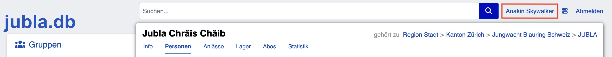
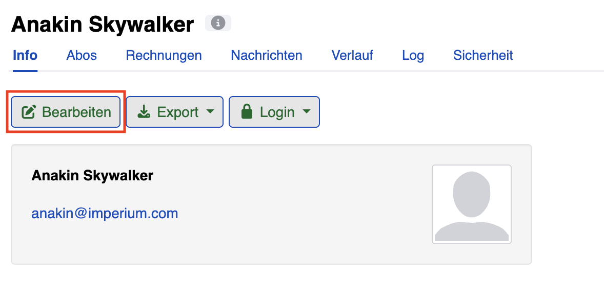

==========================
Kontaktfreigabe verstehen
==========================

Die Kontaktfreigabe bestimmt, welche Ebenen der Jubla dich kontaktieren und dir Informationen senden dürfen. Mit dieser Einstellung behältst du die Kontrolle über deine Daten.

Diese Einstellung ist nur aktiv, wenn du als Ehemalige*r geführt wirst (also keine aktive Rolle mehr hast).

Die 4 Ebenen der Jubla
======================

Es gibt 4 verschiedene Ebenen, die dich kontaktieren können:

**Nationale Ebene: Jungwacht Blauring Schweiz**
- Jungwacht Blauring Schweiz (das Nationale Netzwerk)
- Du erhältst News aus der ganzen Schweiz
- Beispiel: Newsletter des Netzwerks Ehemalige, nationale Anlässe, Informationen zur Jubla Schweiz

**Kantonale Ebene: Dein Kanton**
- Der kantonale Verband deines Kantons (z.B. Jubla Kanton Zürich)
- Du erhältst lokale Infos aus deinem Kanton
- Beispiel: Kantonale Events, kantonale Newsletter, regionale Infos

**Regionale Ebene: Deine Region**
- Die Region, in der deine ehemalige Schar liegt
- Du erhältst Infos speziell für deine Region
- Beispiel: Regionale Anlässe, regionale Treffen

**Lokale Ebene: Deine ehemalige Schar**
- Die Schar, aus der du ausgetreten bist
- Du erhältst Infos direkt von deiner Schar
- Beispiel: Einladungen zu Schar-Treffen, Jubiläen, Informationen zur Schar

Was bedeutet ein Häkchen?
=========================

**Häkchen gesetzt (☑️):**
- Du erlaubst dieser Ebene, dich zu kontaktieren
- Deine Email-Adresse und Daten werden in den Kontaktlisten dieser Ebene angezeigt
- Du erhältst Newsletter und Mailings von dieser Ebene
- Du wirst eingeladen zu Anlässen dieser Ebene

**Häkchen nicht gesetzt (☐):**
- Diese Ebene darf dich nicht kontaktieren
- Deine Daten sind in den Kontaktlisten dieser Ebene nicht sichtbar
- Du erhältst keine Mailings oder Newsletter von dieser Ebene
- Du bekommst keine Einladungen von dieser Ebene

Wo finde ich die Einstellungen?
================================

Die Kontaktfreigabe findest du in deinem Profil:

1. Melde dich bei der jubla.db an
2. Klicke oben rechts auf **deinen Namen**

3. Du siehst dein Profil
4. Klicke auf den Button ``Bearbeiten`` (unterhalb deines Namens oder unten rechts)

5. Scrolle nach unten
6. Du siehst einen Abschnitt **«Kontaktfreigabe»** mit 4 Häkchen
7. Dort kannst du die Einstellungen ändern
8. Klicke auf ``Speichern``, um die Änderungen zu übernehmen

Praktische Beispiele
--------------------

**Beispiel 1: Ich möchte Kontakt mit meiner Schar halten**

- ☑️ Lokale Ebene (Schar)
- ☐ Regionale Ebene
- ☐ Kantonale Ebene
- ☐ Nationale Ebene

→ Nur deine Schar kann dich kontaktieren

**Beispiel 2: Ich möchte auf dem Laufenden bleiben (alles)**

- ☑️ Nationale Ebene
- ☑️ Kantonale Ebene
- ☑️ Regionale Ebene
- ☑️ Lokale Ebene (Schar)

→ Alle Ebenen können dich kontaktieren

**Beispiel 3: Ich möchte Ruhe haben**

- ☐ Nationale Ebene
- ☐ Kantonale Ebene
- ☐ Regionale Ebene
- ☐ Lokale Ebene

→ Niemand kann dich kontaktieren (alle Häkchen leer)
