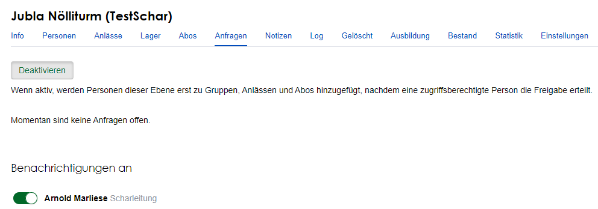
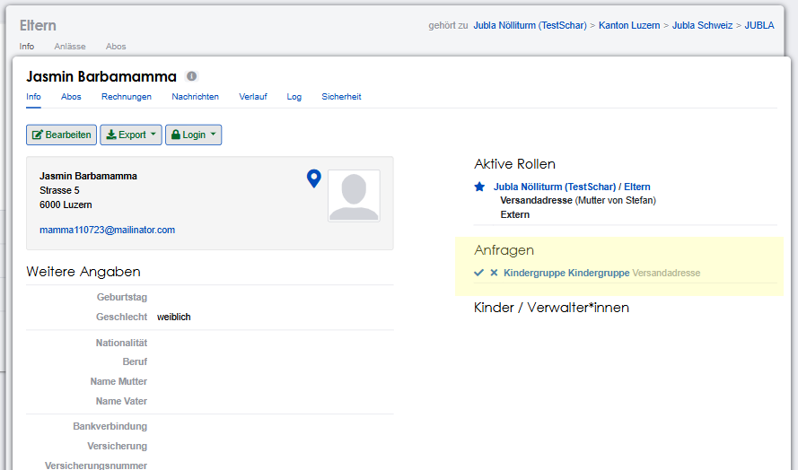

..  _scharverwaltung-link-target:

================
Scharverwaltung
================

Dieser Anleitungsbereich dient der ``Schar- oder Gruppenleitung`` und Personen welche für die Verwaltung der Mitglieder zuständig sind.

Log-in
=======

Die Adresse der Datenbank um sich einloggen zu können, lautet :fa:`database` `db.jubla.ch <https://db.jubla.ch/>`_.

.. figure:: /media/mitgliederverwaltung/schar/login.png
    :name: 
    
    Log-in

* **E-Mail**: Melde dich mit deiner gültigen E-Mail-Adresse an.

  * Falls du nicht weisst welche E-Mail-Adresse gemeint ist, kontrolliere bitte deine Posteingänge deines E-Mail-Anbieters. Die jubla.db versendet jeweils eine Mail mit Zugangslink, welche mit deiner E-Mail-Adresse verknüpft ist, wodurch du dich schlussendlich anmelden kannst. Wenn du keine E-Mail von der jubla.db erhalten hast oder diese nicht mehr findest, melde dich gerne bei deiner `kantonale Arbeitsstelle <https://jubla.ch/ast>`_ der Jubla. 

.. important:: Die Mitglieder sollen sich mit ihren persönlichen (privaten) E-Mail-Adressen in der jubla.db eintragen. Bitte verwendet keine sogenannte Funktionsadressen (z. B. praesident@xxx.ch). Solche (Funktions-)Adressen müssen später immer wieder geändert werden, wenn ein Mitglied in seinem Verein die Funktion wechselt.
* **Passwort**: Passwort eingeben, welches bei der Erstanmeldung auf jubla.db oder letzten Passwortänderungen verwendet wurde.
* **Angemeldet bleiben**: Durch das Anwählen des ``Kästchens`` werden die Anmeldedaten im Browser gespeichert. Beim nächsten Besuch auf der jubla.db wird die Anmeldung automatisch ausgeführt.
* **Anmelden**: Wenn deine Angaben korrekt eingegeben wurden, gelangst du zur jubla.db-Datenbank.
* **Passwort vergessen?**: Falls du dein Passwort vergessen hast, kannst du den ``Passwort vergessen?`` Link betätigen. Durch das Anwählen des Links wirst du auf eine Seite weitergeleitet, welche dir nach Eingabe deiner gültigen E-Mail-Adresse einen neuen Zugang für die Datenbank per E-Mail verschafft. Der Vorstand/Scharleitung kann deine Zwei-Faktor-Authentifizierung (2FA) zurücksetzen.

Navigation
==========

.. figure:: /media/mitgliederverwaltung/schar/navigation.png
    :name: 
    
    Navigation

* **Logo & Profilname**: Durch das Anwählen des ``Jubla-Logos``, welches sich oben links in der Navigationsleiste befindet oder über den ``Profilnamen``, gelangst du von überall her wieder automatisch zu deiner Profilseite zurück.
* **Suche**: Über das ``Suchfeld`` kannst du alle Personen, Gruppen, Vereine, Verbände, Anlässe und Kurse suchen. Die Suchleiste befindet sich in der Mitte der Navigationsleiste. Es werden nur Resultate angezeigt, auf der die Benutzende auch Zugriff haben.
* **Abmelden**: Mit ``Abmelden`` wirst du von der Datenbank abgemeldet.

Module
------

In der Modulauswahl kann das gewünschte Modul gewählt werden: 

* Gruppen
* Anlässe 
* Kurse 
* Einstellungen

.. figure:: /media/mitgliederverwaltung/schar/module_sidebar.png
    :name: 
    
    Sidebar - Modulübersicht

Modul Gruppen
==============

Im Bereich `Gruppen <https://db.jubla.ch/groups/1.html>`_ erhälst du alle Informationen über deine Schar und deinen Verein. Je nach zugeteilter Rolle kannst du Datenbankelemente erstellen, sie ändern, sich dafür anmelden, sie löschen oder austreten.

.. figure:: /media/mitgliederverwaltung/schar/gruppe_sidebar.png
    :name: 
    
    Sidebar - Gruppenübersicht

Die ``Seitennavigation (Sidebar)`` zeigt dir immer in welcher Gruppe du dich zurzeit befindest.

Info
----

In der Registerkarte ``Info`` in `Gruppen <https://db.jubla.ch/groups/1.html>`_ findest du alle relevante Informationen zu deiner Gruppe. Sie gibt Auskunft über die allgemeinen Kontaktangaben, Untergruppen oder weiteren relevanten Informationen.

.. figure:: /media/mitgliederverwaltung/schar/gruppe_uebersicht.png
    :name: Gruppenübersicht

Für jede Gruppe kann eine Kontaktperson, Vereinsadresse oder andere Angaben definiert werden, je nach Gruppentyp.

**Bearbeitungsbereich**

Mithilfe der verschiedenen ``Buttons`` im Bearbeitungsbereich können, je nach Rolle, die Informationen aktualisiert und angepasst werden.

.. figure:: /media/mitgliederverwaltung/schar/gruppe_info_buttons.png
    :name: 
    
    Gruppe - Bearbeitungsbuttons

* **Bearbeiten**: Mit :guilabel:`Bearbeiten` öffnen sich 4 neue Registerkarten; 

  * **Allgemein**: Im Bereich Allgemein können die allgemeinen Angaben zur Gruppe festgehalten werden. 
        * DSE/Datenschutzerklärung Titel: Setze den Titel der Datenschutzerklärung
        * DSE/Datenschutzerklärung: Hier kann die Datenschutzerklärung PDF-Datei hochgeladen werden. Sie ist dann sichtbar, wenn die ``Externe Registrierung`` verwendet wird. 
        * Jubla Sachversicherung: Aktivieren, wenn die Schar eine `Sachversicherung <https://jubla.atlassian.net/wiki/x/CIDORw>`_ abgeschlossen hat.
        * Jubla Haftpflicht / Vereinshaftpflichtversicherung: Aktivieren, wenn die Schar eine `Vereinshaftpflichtversicherung <https://jubla.atlassian.net/wiki/x/AYDNRw>`_ abgeschlossen hat.
        * Jubla Vollkasko: Aktivieren, wenn die Schar eine `Vollkasko Versicherung <https://jubla.atlassian.net/wiki/x/AQCiRw>`_ abgeschlossen hat.

  * **Kontaktangaben**: Im Bereich Kontakangaben werden die Informationen zur Kontakperson und Adresse eingetragen. Im Abschnitt Social Media macht ein Eintrag mit Geo-Koordinaten (WGS84) und dem Namen ``Scharfinder`` die Schar auf der `Website jubla.ch <https://www.jubla.ch/aktivitaeten/gruppen-in-deiner-naehe>`_ sichtbar. Beispiel: ``47.053268, 8.299553`` - ``Scharfinder`` -  ✅``Öffentlich`` (Nur auf Ebene Schar sinnvoll und nicht in einer Kindergruppe)

  * **Externe Registrierung**: Im Bereich Externe Registrierung werden Einstellung gemacht, damit sich Personen ohne jubla.db Profil, für die jeweilige Gruppe registrieren können.
  * **Abos**: ✏️

* **CSV Untergruppen**: Durch :guilabel:`CSV Untergruppen` werden automatisch alle sichtbaren Informationen, welche sich im Bereich ``Untergruppen`` befinden in eine CSV-Datei umgewandelt und exportiert. **CSV** ist ein allgemein gültiges **Datenformat**, welches sich mit Excel oder anderen Programmen bearbeiten und öffnen lässt. Mit der ``Exportfunktion`` lassen sich Excel-Listen exportieren und bearbeiten oder das Erstellen von vordefinierten Etiketten (als Seriendruck). 
* **API-Keys**: Durch das Generieren oder Erstellen eines :guilabel:`API-Keys` können Webseiten oder Apps mit der ``jubla.db`` verknüpft und technisch angebunden werden. Dieser Menüpunkt ist nur für **Administratoren** ersichtlich.
* **Kalender-Feeds**: Ein Kalender-Feed kann anhand von Veranstalter-Gruppen und Tags eine Liste von Anlässen, Kursen und Lagern zusammenstellen. Jeder Kalender-Feed hat einen öffentlichen Link (mit einem calendar_token) der auch erreichbar ist, ohne eingeloggt zu sein. Dieser .ics-Link kann in Kalender-Applikationen eingebunden werden, genau wie das bereits möglich ist für alle Anlässe für die ich angemeldet bin.

Gruppe erstellen
~~~~~~~~~~~~~~~~

Mit :guilabel:`Gruppe erstellen` ist es möglich drei verschiedene Arten von Gruppen zu erstellen.
  
  * Kinder
  * Ehemalige
  * einfache Gruppe

**Gruppe «Ausgetretene Leitungspersonen» (auf ebene Schar)**
^^^^^^^^

Die automatisch erstellte Gruppe mit dem Namen «Ausgetretene Leitungspersonen» ist ein Auffangbecken für Mitglieder welche früher eine Rolle (wie zum Beispiel «Leiter*in») in der Schar hatten. Die Schar bleibt weiterhin mitverantwortlich für diese Profile. 

**Gruppe «Ohne Rollen» (auf ebene Schar)**
^^^^^^^^

Die automatisch erstellte Gruppe mit dem Namen «Ohne Rollen» ist ein Auffangbecken für Profile welche keine Rolle (mehr) haben. Die Scharleitung kann Profile in der Gruppe «ohne Rollen» selbständig löschen. **Das Profil wird dann unwiderruflich entfernt**. Ein Austritt oder Beendigung der Mitgliedschaftsverhältnisse ist in den Statuten deiner Schar oder den Statuten von Jungwacht Blauring Schweiz geregelt. Die Abläufen und Regelungen der Vereins- und Vorstandsarbeit findest du im `jubla.netz Vereinsmanagement <https://jubla.atlassian.net/wiki/x/DYArRg>`_ oder `Leitungsverantwortung als Schar- und Lagerleitung <https://jubla.atlassian.net/wiki/x/OwDXQg>`_. 

Personen
---------

Im Abschnitt ``Personen`` werden Nutzer*innen aufgelistet, welche mit deiner Schar in irgendeiner Form in Verbindung stehen. Diese Funktion ist nicht sichtbar für andere Vereine. 

.. figure:: /media/mitgliederverwaltung/schar/personen/gruppe_personen_uebersicht.png
    :name: 
    
    Personen - Übersicht

Durch das Anwählen der ``Buttons`` kann die Ansicht verändert und gefiltert werden. Wenn beispielsweise nur die ``Mitglieder`` angezeigt werden sollen, dann kannst du :guilabel:`Mitglieder` anwählen. 

.. figure:: /media/mitgliederverwaltung/schar/personen/personen_anzeigefilteroptionen.png
    :name: 
    
    Anzeigefilteroptionen

**Bearbeitungsbereich**

.. figure:: /media/mitgliederverwaltung/schar/personen/personen_info_buttons.png
    :name: 
    
    Info - Bearbeitungsbuttons

* **Person hinzufügen**

  * **Bestehende Person hinzufügen**: Hier kannst du Personen, die bereits ein Profil in deiner Schar haben in einer Gruppe hinzufügen. Zum Beispiel eine Leitungsperson in einer Kindergruppe.
  * **Neue Person hinzufügen**: Mit dieser Funktion werden neue Personenprofile erstellt.

* **Liste importieren**: Durch :guilabel:`Liste importieren` ist es möglich eine Liste im CSV-Datenformat zu importieren. Wenn du allenfalls eine Personenliste zur Verfügung oder erstellt hast, kontrolliere ob diese bereits im CSV Datenformat ist. Wenn ja, kannst du sie einwandfrei hochladen. Falls die Liste nicht im korrekten Datenformat (also keine CSV-Datei) ist, versuche es in ein CSV-Datenformat umzuwandeln (für den Umwandlungsprozess gibt es spezifische Webseiten im Internet).
* **Export**: Mit :guilabel:`Export` können die Personen exportiert werden. Dabei stehen dir verschiedene Datenformate für den Export zur Verfügung. 
* **Drucken**: Mit :guilabel:`Drucken` kann eine Listen mit den verschiedenen Personen gedruckt werden.
* **Duplikate**: Mit :guilabel:`Duplikate` kannst du Duplikate abrufen. Somit kann überprüft werden, ob Daten und Informationen doppelt vorhanden sind. Beispielsweise dieselbe Person die mehrfach vorkommt in einem Abschnitt.

Duplikate
~~~~~~~~~~~~~~~~
**Was sind Duplikate?**

Auf der jubla.db können Personen versehentlich mehrfach erfasst werden. Solche doppelten Einträge nennt man Duplikate. Das System erkennt mögliche Duplikate automatisch anhand von diversen Kriterien. Um die Datenbank ordentlich zu halten, kannst du die doppelten Einträge zusammenführen.

**Wie werden Personen-Duplikate erkannt?**

Hitobito analysiert jede Nacht die Einträge in der Datenbank und ergänzt die Liste von Duplikaten. Zwei Personen zählen als Duplikate, wenn die Felder Vorname, Nachname, Firmenname, Postleitzahl und Geburtsdatum übereinstimmen (bei Postleitzahl und Geburtsdatum zählt es auch, wenn das Feld bei einer der Personen leer ist).
Ein Beispiel: Anna Berger (PLZ 1000, Geburtsdatum 01.01.1970) wird als Duplikat von Anna Berger (ohne PLZ oder Geburtsdatum) erkannt. Anna (PLZ 1000, Geburtsdatum 01.01.1970) ohne Nachname ist hingegen kein Duplikat, der Nachname muss zwingend übereinstimmen oder bei beiden Personen leer sein.

**Wo kann ich Duplikate zusammenführen?**

Wenn eine Person mehrfach erfasst wurde, kannst du die Duplikate unter ``Personen`` finden und dort mit einem Klick auf den Button :guilabel:`Zusammenführen` zusammenführen. Beachte dabei, dass das andere Profil danach dauerhaft gelöscht ist. Stelle daher sicher, dass wichtige Informationen oder Verknüpfungen aus dem zu löschenden Profil vorher gesichert oder übertragen wurden.

**Was passiert, wenn ich ein Duplikat zusammenführe?**

Beim Zusammenführen werden die Rollen, Telefonnummern, zusätzlichen E-Mail-Adressen, Social Media Einträge, Rechnungen, Notizen, Tags, Abos, Familienmitglieder, Event Einladungen und Teilnahmen sowie auch Qualifikationen übernommen. Alle anderen Daten im Profil ohne Vorrang werden dauerhaft gelöscht.

.. figure:: /media/mitgliederverwaltung/schar/personen/personen_duplikate.png
    :name: 
    
    Personen Duplikate zusammenführen

.. important:: Wenn du den Button :guilabel:`Zusammenführen` wählst, wird das Profil, das du als Duplikat löschen möchtest, dauerhaft gelöscht und kann nicht wiederhergestellt werden. Dabei werden auch alle dazugehörigen Verknüpfungen und Beziehungen gelöscht. Gehe daher mit Bedacht vor, wenn du Duplikate zusammenführst.

Anlässe
-------

Im Abschnitt ``Anlässe`` erhälst du Informationen zu den Anlässen. 

.. figure:: /media/mitgliederverwaltung/schar/anlaesse/gruppe_anlaesse_uebersicht.png
    :name: 
    
    Anlässe - Übersicht

Mit den ``Buttons`` können Anlässe erstellt, angezeigt und exportiert werden. Zusätzlich können sich ``Mitglieder`` für die ``Anlässe`` anmelden. 

.. figure:: /media/mitgliederverwaltung/schar/anlaesse/gruppe_anlaesse_buttons.png
    :name: 
    
    Anlässe - Bearbeitungsbutton

* **Anlass erstellen**: Mit :guilabel:`Anlass erstellen` öffnet sich ein neues Fenster in dem ein neuer Anlass erstellt werden kann.  
* **Export**: Mit :guilabel:`Export` kann der Anlass entweder im CSV-Dateiformat oder in einem Excel exportiert werden.
* **Kalender Export**: Mit :guilabel:`Kalender Export` werden die Anlässe automatisch in ein ICS-Dateiformat umgewandelt und im Browser heruntergeladen. Diese ICS-Datei kann schlussendlich in einen digitalen Kalender wieder importiert und eingefügt werden.

Anlass erstellen
~~~~~~~~~~~~~~~~~

Hier wird euch anhand eines Scharanlass erklärt, wie ihr trotz getrennten Scharen Jungwacht und Blauring einen gemeinsamen Anlass via jubla.db administrieren könnt.

.. important:: Die Eltern sollen wissen, dass der Anlass gemeinsam stattfindet und somit Blauring oder Jungwacht die Daten der Kinder der jeweiligen anderen Schar sieht.

Unter :menuselection:`Gruppe --> eigene Schar --> Anlässe` kann die Scharleitung mithilfe des :guilabel:`Anlass erstellen` Buttons verschiedene Anlässe erstellen und administrieren.

.. image:: /media/anlaesse/anlass_uebersicht.png

Die **Scharleitung** muss auf der **Scharebene** den **Anlass** erstellen. Der Anlass muss sichtbar sein somit ist es wichtig den :guilabel:`Haken` anzuwählen.

.. image:: /media/anlaesse/anlass_erstelle_haken.png

.. list-table::
   :header-rows: 1
   :stub-columns: 1

   * - Registermenü
     - Beschreibung 
   * - Daten
     - In diesem Abschnitt wird der Zeitraum für den Anlass eingetragen. Mit einem Start- sowie Enddatum wird festgelegt, von wann bis wann der Anlass stattfindet.
   * - Anmeldung
     - Hier kannst du festlegen von wann bis wann die Personen Zeit haben sich für den Anlass anzumelden. Zudem kann die minimale oder maximale Teilnehmeranzahl festgelegt werden. Zusätzlich gibt es noch weitere Einstellungsmöglichkeiten bezüglich des Anmeldungsverfahrens.
   * - Anmeldeangaben
     - Hier kannst du mithilfe zusätzlicher Fragen weitere Angaben von den Personen verlangen. Durch das Definieren von Fragen an die Teilnehmenden, erhälst du weitere Informationen die wichtig sind für dich als Veranstalter*in. Alle diese Antworten in den Anmeldeangaben inklusive Bemerkungen werden nach 13 Monaten nach dem Anlass automatisch gelöscht. Die Fragen der Anmeldeangaben werden automatisch sortiert. Wenn du eine bestimmte Reihenfolge möchtest, füge vorne Zahlen oder Buchstaben ein (01, 02,…10 oder A, B, C). Die Ausgabe kann unterschiedlich sein. Teste das Formular am besten vorher.
   * - Administrationsangaben
     - Hier kannst du weitere Angaben pro Teilnehmer/-in definieren, welche nur für die Anlassverwaltung verwendet werden.
   * - Kontaktangaben
     - Hier kannst du wählen, welche Kontaktangaben bei der Anmeldung von den Personen abgefragt werden sollen.

Leitung hinzufügen
~~~~~~~~~~~~~~~~~~~

Die Verantwortlichen können nun unter :menuselection:`Gruppe --> eigene Schar --> Anlässe` den erstellten ``Anlass`` aufrufen und eine ``Leitung`` hinzufügen.

.. image:: /media/anlaesse/anlass_anzeigen.png

Im geöffneten Anlassfenster zu der Registerkarte ``Teilnehmenden`` navigieren und unter dem :guilabel:`Person hinzufügen` Button die ``Leitung`` anwählen.

.. image:: /media/anlaesse/anlass_leitung.png

Danach die Verantwortlichen inkl. Jungwachtsleitung (oder umgekehrt) als Leitung definieren.

.. image:: /media/anlaesse/anlass_leitung_erstellen.png

Und schon kann die Jungwachtsleitung (oder Blauring) auf dem Anlass auf Ebene Blauring (oder Jungwacht) auch die Teilnehmenden des Blaurings sehen, sowie Adresse und Telefonnummer. (Ich habe beim Anlass Telefonnummer und Adresse als Obligatorisch gesetzt)

.. image:: /media/anlaesse/gemeinsamer_anlass_ansicht.png

.. hint:: Die Teilnehmenden können sowohl von Jungwacht, wie auch Blauring hinzugefügt werden. Sofern sie als Rolle Leitung definiert wurden. Teilnehmende die bereits ein Login auf der jubla.db haben können sich selbständig über den Direktink anmelden.

**Falls die Anmeldung durch die Eltern gemacht wird:**

Das Elternteil muss sich nur bei einer Schar registrieren zum Beispiel in einer Jungwachtsgruppe.
Danach kann das Elternteil auch vom Blauring gefunden und bei einer Blauringgruppe hinzugefügt werden. Somit ist das Elternteil bei beiden Scharen erfasst und es kann von beiden Scharleitungen je die jeweiligen Kinder zugewiesen werden. Sofern es eine Verwalterin oder Verwalter gibt, ist deren Name, E-Mail und Telefonnummer in der Anmeldung (PDF) direkt aufgeführt. 

Lager
-----

In diesem Abschnitt erhälst du Informationen zu zukünftigen Lager.

.. figure:: /media/mitgliederverwaltung/schar/lager/gruppe_lager_uebersicht.png
    :name: 
    
    Lager - Übersicht

Mit diesen ``Buttons`` können Lager erstellt, angezeigt und exportiert werden.

.. figure:: /media/mitgliederverwaltung/schar/lager/gruppe_lager_buttons.png
    :name: 
    
    Lager - Bearbeitungsbutton

* **Lager erstellen**: Mit :guilabel:`Lager erstellen` öffnet sich ein neues Fenster in dem ein neuer Anlass erstellt werden kann.  
* **Export**: Mit :guilabel:`Export` können die Lagerinformationen entweder im CSV-Dateiformat oder in einem Excel exportiert werden.
* **Kalender Export**: Mit :guilabel:`Kalender Export` wird das Lager automatisch in ein ICS-Dateiformat umgewandelt und im Browser heruntergeladen. Diese ICS-Datei kann schlussendlich in einen digitalen Kalender wieder importiert und eingefügt werden.

Lager erstellen
~~~~~~~~~~~~~~~~

In diesem :fa:`video` `Anleitungsvideo <https://jubla.atlassian.net/wiki/spaces/WISSEN/pages/1122467867/Jubla-Datenbank#Lagererfassung-auf-der-jubla.db>`_ wird dir Schritt für Schritt erklärt, wie die Lagererfassung in der jubla.db-Datenbank funktioniert. Im jubla.netz findest du die Infos, was du bei der Erstellung einer `Lageranmeldung <https://jubla.atlassian.net/wiki/x/BwAlW>`_ beachten sollst.  

Unter der Registerkarte ``Lager`` kannst du mithilfe :guilabel:`Lager erstellen` ein Lager für deine Schar erstellen.

Durch das Anwählen des :guilabel:`Lager erstellen` Buttons öffnet sich ein Fenster in dem du die Einstellungen und Informationen zum Lager spezifischer definieren kannst.

.. list-table::
   :header-rows: 1
   :stub-columns: 1

   * - Registermenü
     - Beschreibung
   * - Allgemein
     - In diesem Menüregister kannst du den Namen, die Lagerart, die Adresse des Lagers bestimmen, allenfalls könntest du noch eine kleine Beschreibung als Zusatzinformation angeben. Jedes Lager sollte eine Kontaktperson festlegen, welches auch in diesem Bereich getan werden kann. Es besteht zudem die Möglichkeit ein Motto zu bestimmen. Mit dem aktivieren "Anlass ist für die ganze Datenbank sichtbar" ermöglichst du anderen Scharen, sich für euer Lager anzumelden. Zum Schluss fügt ihr noch euren Coach hinzu.✏️ 
   * - Daten
     - In diesem Abschnitt wird der Zeitraum für das Lager eingetragen. Mit einem Start- sowie Enddatum wird festgelegt, von wann bis wann das Lager stattfindet.
   * - Anmeldung
     - Hier kannst du festlegen von wann bis wann die Personen Zeit hat, sich für das Lager anzumelden. Zudem kann die minimale oder maximale Teilnehmeranzahl festgelegt werden. Zusätzlich gibt es noch weitere Einstellungsmöglichkeiten bezüglich des Anmeldungsverfahrens, wie zum Beispiel Abmeldungsmöglichkeiten, Unterschriftserforderlichkeit oder Teilnehmersichtbarkeit.
   * - Anmeldeangaben
     - Hier kannst du mithilfe zusätzlicher Fragen weitere Angaben von den Personen verlangen. Durch das Definieren von Fragen an die Teilnehmenden, erhälst du weitere Informationen die wichtig sind für dich als Veranstalter*in. Zum Beispiel wäre eine Frage ob jemand sein eigenes Zelt mitnimmt oder andere Informationen die für dich als Veranstaler*in wichtig sein könnten. Obligatorische Angaben für die NDS sind: Name, Vorname, Geburtsdatum, Geschlecht (nur weiblich oder männlich zulässig auf der NDS), AHV Nr, Nationalität, Muttersprache, Strasse, Hausnummer, PLZ, Ort, Land. Die AHV Nr. wird nur im Anlass und nicht im Profil gespeichert. Alle diese Antworten in den Anmeldeangaben inklusive Bemerkungen werden nach 13 Monaten nach dem Anlass automatisch gelöscht. Die Fragen der Anmeldeangaben werden automatisch sortiert. Wenn du eine bestimmte Reihenfolge möchtest, füge vorne Zahlen oder Buchstaben ein (01, 02,…10 oder A, B, C). Die Ausgabe kann unterschiedlich sein. Teste das Formular am besten vorher.
   * - Administrationsangaben
     - Hier kannst du weitere Angaben pro Teilnehmer/-in definieren, welche nur für die Anlassverwaltung sichtbar sind.
   * - Kontaktangaben
     - Hier kannst du wählen, welche Kontaktangaben bei der Anmeldung von den Personen abgefragt werden sollen.

Teilnehmende hinzufügen
~~~~~~~~~~~~~~~~~~~~~~~~

In diesem :fa:`video` `Anleitungsvideo <https://jubla.atlassian.net/wiki/spaces/WISSEN/pages/1122467867/Jubla-Datenbank#Teilnehmerverwaltung-f%C3%BCrs-Lager-via-jubla.db>`_ wird dir Schritt für Schritt gezeigt, wie du die Teilnehmenden für das Lager verwalten kannst.

Abos
----

In diesem :fa:`video` `Anleitungsvideo <https://www.youtube.com/watch?v=6V2fUfgb7DM&list=PLg4O1polb_cHlt8CEKjktmjzU6441z3Kl&index=5>`_ wird dir Schritt für Schritt erklärt, wie du ganz einfach und simpel eine ``Abo erstellen`` kannst.

.. hint:: Wenn du regelmässig Nachrichten an die gleichen Personen versenden musst, lohnt es sich ein Abo zu erstellen. Ein ``Abo`` kannst du dir wie ein intelligenter E-Mail-Verteiler vorstellen. Somit ist der Versand für dich massiv einfacher. 

.. figure:: /media/mitgliederverwaltung/schar/abos/gruppe_abos_uebersicht.png
    :name: 
    
    Abos

**Wie funktioniert der Versand via Abo?**

Sende deine Nachricht einfach an die E-Mail-Adresse, die du im Feld **Mailinglisten Adresse** festlegt hast (wird dir im Abschnitt **«Wie erstelle ich ein Abo?»** genauer erklärt). Die jubla.db versendet dann eine Nachricht automatisch an alle **Abonnent*innen** des ``Abos``.

**Wie erstelle ich ein Abo?**

Durch das Anwählen von :guilabel:`Abo erstellen` öffnet sich ein Fenster mit der 3 Registerkarten, ``Allgemein``, ``Mailing-Liste (E-Mail)`` und ``MailChimp``, indem ein neues Abo eingerichtet werden kann. 

* **Allgmein**: Im Register ``Allgemein`` kannst du festlegen, wie das Abo heissen soll. Zusätzlich kannst du noch eine kleine Beschreibung hinzufügen und einen Absendername definieren.

* **Mailing-Liste (E-Mail)**: Im Register ``Mailing-Liste (E-Mail)`` bestimmst du wie E-Mail-Adresse des Abo heisst, wo schlussendlich deine Nachrichten (E-Mails) versendet. Du wirst nur aufgefordert einen ``Namen`` zu bestimmen die **E-Mail-Domain** (``@...``) ist bereits vorgebgeben und lautet immer auf ``@db.jubla.ch``. Wenn du einen Namen für die Mailing-Liste-Adresse gefunden hast, ist es möglich noch weitere Absender hinzuzufügen oder zusätzliche Labels und Einstellungen zu definieren.
  
  .. important:: Für das versenden der Nachricht (E-Mail) spielt es keine Rolle welchen E-Mail-Anbieter oder welches Programm du verwendest um deine E-Mail zu versenden. Das einzig wichtige was zu beachten ist, dass du deine Nachricht an diese E-Mail-Adresse sendest, wo du im Feld **Mailinglisten Adresse** vergeben hast. Beispielsweise hast du den Namen **"spesen.testschar"** gegeben, somit lautet die E-Mail-Adresse deines Abos spesen.testschar@db.jubla.ch. Wenn du nun ein Informationsmail zum Thema Spesen an verschiedene Personen versenden möchtest um sie zu informieren, sendest du deine Nachricht bitte an die Adresse **spesen.testschar@db.jubla.ch**.

**Wie kann ich Personen zu meinem Abo hinzufügen?**

Wenn du dein Abo erstellt und gespeichert hast, wird es bei deiner Schar unter dem Register ``Abo`` angezeigt. Bitte wähle das entsprechende Abo aus, wo du die Personen hinzufügen möchtest. Im geöffneten Abo gehe zu Register ``Abonnenten``, wo du mit :guilabel:`Person hinzufügen` die gewünschten Personen für dieses Abo bestimmen und hinzufügen kannst.

**Was gilt es zu beachten?**

Sind in einem Profil neben der Haupt-E-Mail Adresse weitere E-Mail Adressen hinterlegt, muss das **Häckchen** ``Versand nur an Haupt E-Mail Adresse`` deaktiviert sein, damit die weiteren E-Mail-Adressen deine Nachrichten ebenfalls erhalten. Über ``Abos`` sollen idealerweise **keine** **Anhänge** verschickt werden. Anhänge unter 1 Megabyte sind vertretbar, Versände mit Anhängen mit mehr als 10 Megabyte werden verworfen und nicht versendet.  
Es können beliebig viele Abos erstellet werden (bspw. für Gruppenstunden/Eltern/Empfängerlisten/etc. ). Dieses Abo-Konstrukt ist dann spannend, wenn Empfängerlisten für Kommunikationen auf Knopfdruck aufbereitet werden sollten. Abhängig von der Konfiguration können sich Menschen in der jubla.db selbständig für ein Abo an- und abmelden. Wer für das Abo berechtigt ist, kann im Abo konfiguriert werden. Zudem kann eingestellt werden, welche Personen standardmässig ein Opt-In auf dieses Abo erhalten (z.B. alle Personen mit Rolle Mitglied). Pro Abo kann eine Empfängerliste auf Knopfdruck erzeugt werden. Dabei kann der Nutzer dem System mitteilen, welche Spalten in der Empfängerliste ausgegeben werden sollten.
Im jeweiligen Abo gibt es den Tab ``Bounces``. Eine Bounce Message (englisch bounce ‚abprallen‘, ‚zurückwerfen‘), ist eine Fehlermeldung, die von einem Mailserver automatisch erzeugt wird, wenn eine E-Mail nicht zustellbar ist.

Anfragen 
---------

Als **Vorstand/Scharleiter*in** einer Schar bist du zuständig für die **Mitglieder** (und deren Daten). Die Datenbank erlaubt die Zuteilung von Personen in andere Gruppen, Anlässen und Abos erst nach einer Freigabe. Damit kann eine Weitergabe von Daten gemäss Statuten und Datenschutzbestimmungen gesteuert werden. Mitglieder (und deren Profil-Informationen) können so nicht ohne aktive Zustimmung von anderen Ebenen/Gremien übernommen werden. Alle Anfragen werden an den Vorstand gemäss den Einstellungen verschickt. Normalerweise beantwortet das Mitglied mit aktivem Login die Anfrage gleich selbständig in eigener Verantwortung. Für verwaltete Mitglieder ist der Vorstand zuständig. 

Ablauf:

- Die im Profil gewählte ``Hauptgruppe`` bekommt eine Anfrage.
- Ein Profil mit aktivem Login bekommt die Anfrage an die hinterlegte Haupt-E-Mail-Adresse zugeschickt. 
- Die Anfrage kann direkt aus der erhatlenen E-Mail, im Profil oder in der Registerkarte ``Anfragen`` beantwortet werden.  
- Achtung: Für durch die Schar/Ebene verwaltete Profile **ohne Haupt-E-Mail-Adresse** oder **ohne aktives Login** ist der Vorstand zuständig.

    Offene Anfragen in der Registerkarte ``Anfragen``

    Offene Anfrage im eigenen ``Profil``

Mehr dazu findest du :fa:`circle-info` `im Hitobito-Handbuch <https://hitobito.readthedocs.io/de/latest/access_concept.html#security-zugriffsanfragen-und-manuelle-freigabe>`_.

Notizen
-------

Hier sind die unter der Registerkarte ``Info`` erfassten **Notizen** zum Verein oder zur Gruppe aufgelistet. Zusätzlich sind auch die Notizen der Untergruppen ersichtlich. Dieser Menüpunkt ist nur für den  **Vorstand** ersichtlich.

In der jubla.db lassen sich beliebig viele Notizen auf einer Person zu erfassen. Die Notizen sind auf 255 Zeichen limitiert und Zeilenumbrüche sind möglich. Im Sinne der Datenschutzrichtlinien dürfen keine besonders schützenswerte Daten eingegeben werden (z.B. AHV-Nummer, Berufsbezeichnung, Religion, Essgewohnheiten). Die erfassten Notizen sind für das Mitglied nicht ersichtlich. Die Notizen sind weder protokolliert noch versioniert. Sie können nicht in Listen in Form von Spalten ausgegeben und exportiert werden. Notizen kann nicht gefiltert werden.

Log
---

In der Registerkarte ``Log`` wird aufgezeichnet, was für Veränderungen an deinem Profil, von dir oder in seltenen Fällen deiner Scharleitung oder Betreuungsperson (natürlich nur mit Einwilligung), unternommen wurden. Es liefert dir eine Übersicht zu welchem Zeitpunkt und auf welche Art deine Daten verändert werden oder wurden. Es enthält Informationen wie Datum, Uhrzeit, Benutzername und Art des Befehls, der ausgeführt wurde. Dies hilft dir die Veränderungen in deinem Benuterprofil zu erkennen und überwachen.

Ausbildung
-----------

In diesem Abschnitt erhälst du Informationen zu Personen welche ``Ausbildungen`` abgeschlossen haben in Bezug auf deine Schar.

.. figure:: /media/mitgliederverwaltung/schar/ausbildung/gruppe_ausbildung_uebersicht.png
    :name: 
    
    Ausbildung

Die ``Legende`` gibt Auskunft über die Gültigkeitstatuts der Ausbildung. 

.. figure:: /media/mitgliederverwaltung/schar/ausbildung/ausbildung_anzeigefilteroptionen.png
    :name: 
    
    Anzeigefilteroptionen

Durch das Anwählen der ``Buttons`` kann die Ansicht verändert und gefiltert werden. Wenn beispielsweise nur die ``Mitglieder`` angezeigt werden sollen, dann kannst du :guilabel:`Mitglieder` anwählen. 

Bestand
-------
Unter der Registerkarte ``Bestand`` wird der Bestand der gesamten Schar angezeigt. Somit werden in dieser Ansicht Personen aus der Schar, den Untergruppen sowie die Ehemaligen präsentiert.

Gelöscht
--------
Unter der Registerkarte ``Gelöscht`` werden frühere, inzwischen gelöschte Untergruppen des Vereins angezeigt.

Modul Anlässe
==============

Diese Übersicht zeigt dir alle Anlässe und Lager, welche dir gemäss deinen Rollen zum Anmelden, Ändern oder Schliessen zur Verfügung stehen. 

.. figure:: /media/mitgliederverwaltung/schar/anlaesse.png
    :name: 
    
    Anlässe
    
* Mit :guilabel:`Anmelden` kannst du dich für einen Anlass anmelden. Du wirst augefordert für den Anlass deine Kontaktangaben einzutragen.  
  
  * Je nach Veranstaltung sind noch weitere Informationen erforderlich. Zum Beispiel werden Informationen zur Ernährungsweise verlangt im Bezug auf die Essensplanung für den Anlass, ob man sich vegan oder vegetarisch ernährt und eventuell allergisch ist auf gewisse Lebensmittel.

* Teilnehmende

Modul Kurse
============

Über diesen `Link <https://db.jubla.ch/list_courses>`_ kommst du zur Übersicht aller Kurse. Die ``Seitennavigation (Sidebar)`` zeigt dir immer in welchem Kurs du dich zurzeit befindest.

.. figure:: /media/mitgliederverwaltung/schar/kurse_sidebar.png
    :name: 
    
    Sidebar Kursansicht

In der Gesamtübersicht werden dir alle Kurse gezeigt, welche für dich relevant sein könnten. So findest du schnell und unkompliziert alle Kurse und Informationen.

.. figure:: /media/mitgliederverwaltung/schar/kurse.png
    :name: 
    
    Kurse
    

Durch verschiedene ``Such- und Filterfunktionen`` können die Kurse zusätzlich gefiltert und spezifischer gesucht werden. 

Modul Einstellungen
====================

Über diesen `Link <https://db.jubla.ch/label_formats>`_ kommst du zur Übersicht der Einstellungen. 

.. figure:: /media/mitgliederverwaltung/schar/einstellungen_sidebar.png
    :name: 
    
    Sidebar Einstellungen

Die ``Seitennavigation (Sidebar)`` zeigt dir immer in welcher Einstellung du dich zurzeit befindest.

* **Etikettenformat**: Mit den ``Etikettenformate`` kannst du eigene Etikettenformate definieren, welche für den Druck von (Personen-)Listen verwendet werden können.

* **Kalender integrieren**: Mit :guilabel:`Kalender integrieren` wird automatisch ein ``Downloadlink`` mit deinen gespeicherten Terminen, Events und Anlässe generiert. Beim Anwählen des ``Links`` werden alle gespeicherten Termine in deinem Kalender automatisch in ein ICS-Dateiformat umgewandelt und im Browser heruntergeladen. Diese ICS-Datei kann schlussendlich in einen digitalen Kalender wieder importiert und eingefügt werden.

Wie du den Kalender erfolgreich importieren kannst, findest mithilfe folgender Links :fa:`link` `Google <https://support.google.com/calendar/answer/37118?hl=de&co=GENIE.Platform%3DDesktop&oco=1>`_, :fa:`link` `Android <https://support.google.com/calendar/answer/37118?hl=de&co=GENIE.Platform%3DAndroid&oco=1>`_ und :fa:`link` `Apple <https://support.apple.com/de-ch/guide/calendar/icl1023/mac>`_.

  .. important:: Mit diesem Link (URL oder auch Adresse) kannst du von anderen Anwendungen aus auf deine Anlässe zugreifen. 
    
  .. danger:: Gib diese Adresse nur an Personen weiter, die alle deine Termindetails sehen dürfen. Wenn du Missbrauch vermutest, kannst du die Adresse zurücksetzen und dadurch die aktuelle ungültig machen. Alle Kalender die noch die alte Adresse kennen, können danach nicht mehr deine Anlässe sehen.

VERSCHIEBUNG ✏️
============

Login senden
-------------

**Login schicken 🔒**  

Dieser Befehl schickt den Benutzende ein E-Mail mit dem Link zum setzen eines Passwortes. Fährt man mit der Maus über diesen Button erscheint die Information, ob die Benutzende bereits ein Login hat, oder nicht.
  
.. image:: /media/mitgliederverwaltung/schar/login_senden_mit.png
.. image:: /media/mitgliederverwaltung/schar/login_senden_ohne.png

**Zwei-Faktor-Authentifizierung zurücksetzen**

Der zweite Faktor der Zwei-Faktor-Authentifizierung (2FA) kann bei Bedarf zurückgesetzt werden und kann danach erneut eingerichet werden. 

.. image:: /media/mitgliederverwaltung/schar/2fa-zuruecksetzten.png

